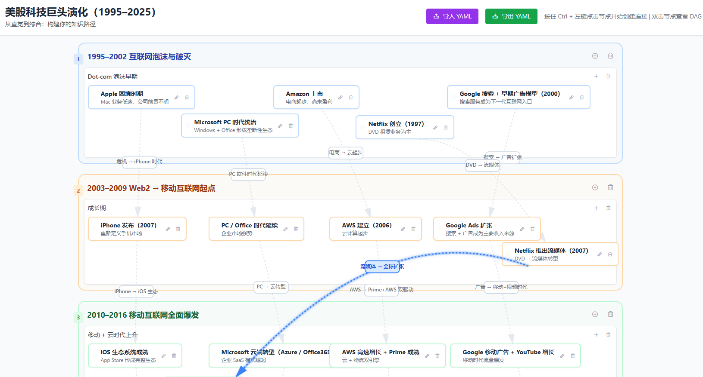

## 知识 DAG 构建器（Knowledge DAG Builder）

本项目是一个用于**读书笔记与知识管理**的可视化工具，通过「项目 → 章节 → 部分 → 知识点」四级结构，构建底层为 DAG（有向无环图）的知识网络，帮助你：

- 梳理一本书或一门课程的结构
- 明确不同知识点之间的依赖关系
- 从任意知识点出发查看其局部 DAG 视图

---

## 界面预览

主界面示例（项目侧边栏 + 知识画布）：



---

## 功能概览

- **多项目管理**
  - 左侧窄侧边栏列出所有项目
  - 支持新建、重命名、删除项目
  - 支持以 YAML 导入 / 导出项目

- **层级结构编辑**
  - 每个项目下有多个章节（Chapter）
  - 章节下有多个部分（Section）
  - 每个部分中可以添加任意多个知识节点（Node）
  - 节点支持编辑标题与内容（备注）

- **节点布局与拖拽**
  - 节点初次创建时：  
    - 如果没有 `x / y` 坐标，则按 `position` 排序自动排布  
    - 默认水平排列、自动换行、节点间水平间距大于 100px
  - 支持在部分内部自由拖拽节点
  - 拖拽后新的坐标会写回后端并持久化到 SQLite

- **连接关系（边 / Edge）**
  - 使用 `Ctrl + 左键` 选择起点和终点，创建连接
  - 支持在同一部分内连接，或跨章节连接
  - 每条边都可以：
    - 悬停高亮
    - 点击编辑标签
    - 删除连接
  - 连接线使用 SVG 绘制，带有 Tailwind 风格的颜色与宽度、悬停高亮和箭头

- **DAG 视图（DAGPanel）**
  - 双击节点可在右侧浮动面板中查看该节点相关的 DAG 视图
  - 使用 `vis-network` 进行布局与展示
  - 节点按章节 / 部分进行层级化排列，便于理解上下游关系

- **YAML 导入 / 导出**
  - 导出时仅包含：
    - 章节 / 部分 / 节点三层结构
    - 每个节点的 `id / name / content / position / x / y`
    - 所有边信息（source / target / label）
  - 导入时：
    - 始终创建一个**新项目**，不会覆盖已有项目
    - 为章节 / 部分 / 节点重新生成内部 ID，并建立旧 ID → 新 ID 的映射
    - 边会根据映射后的节点 ID 重新构建

---

## 技术栈与结构

- **后端**
  - 框架：FastAPI
  - 数据模型：Pydantic
  - 数据库：SQLite（通过自定义 `Storage` 封装）
  - 图算法：NetworkX（用于 DAG 校验与分析）
  - 主要模块：
    - `knowledge_dag/models.py`：项目 / 章节 / 部分 / 节点 / 边及请求模型
    - `knowledge_dag/services.py`：业务逻辑（节点、边、项目、导入导出等）
    - `knowledge_dag/storage.py`：SQLite 存储与迁移逻辑
    - `knowledge_dag/routes.py`：FastAPI 路由定义

- **前端**
  - 框架：Vue 3 + Vite
  - UI：Tailwind CSS + Element Plus
  - DAG 展示：vis-network
  - 主要组件：
    - `App.vue`：整体布局、项目管理、全局连接线绘制
    - `components/ProjectSidebar.vue`：项目列表与项目操作
    - `components/ChapterSection.vue`：章节与部分 + 节点拖拽与布局
    - `components/DAGPanel.vue`：节点局部 DAG 视图
  - API 封装：
    - `src/api.js`：所有与后端交互的 Axios 封装方法

---

## 开发与运行

### 1. 克隆仓库

```bash
git clone <your-repo-url>  # 请替换为实际仓库地址
cd 20251202_readmap
```

### 2. 启动后端（FastAPI + Uvicorn）

```bash
cd backend
python -m venv .venv
.venv\Scripts\activate  # Windows
# source .venv/bin/activate  # macOS / Linux

pip install -r requirements.txt
python run.py
```

后端默认监听：`http://0.0.0.0:8000`

### 3. 启动前端（Vue 3 + Vite）

```bash
cd frontend
npm install
npm run dev
```

前端默认访问地址：`http://localhost:5173`（具体端口以终端输出为准）。

---

## 数据与存储

- 默认数据库文件路径：`backend/knowledge_dag.db`
- 首次启动时会自动：
  - 初始化数据库表结构（projects / chapters / sections / nodes / edges）
  - 如存在旧 JSON 数据，可自动迁移到 SQLite（视配置而定）
- 删除某个项目时，其相关的：
  - 章节 / 部分 / 节点
  - 边（连接关系）
  - 都会通过外键级联或业务逻辑一并清理

如果在修改数据库结构后出现无法启动或异常，可以：

1. 备份现有 `knowledge_dag.db`
2. 删除原数据库文件
3. 重新启动后端，让系统按最新结构自动创建新的数据库

---

## 使用建议

- **读书 / 课程梳理**
  - 每本书 / 每门课建一个项目
  - 章节对应书的章节或课程的大模块
  - 部分对应小节或知识簇
  - 节点用于记录具体概念、公式、例题、历史事件等

- **知识连接**
  - 使用连接线表达「依赖 / 推导 / 对应 / 类比」等关系
  - 通过 DAG 视图查看某个知识点的前置依赖与后续应用

- **版本控制 / 导出**
  - 对重要项目使用 YAML 导出进行备份
  - 可以在其他环境导入 YAML，继续编辑同一套知识结构

---

## 备注

- 本 README 仅概括主要功能与使用方式，具体实现细节可直接阅读对应源码文件。
- 如有新的结构需求（例如增加标签、颜色主题、搜索等），可以在现有模型基础上继续扩展。

# 知识图谱构建器 (Knowledge DAG Builder)

一个用于构建和管理知识依赖关系的 Web 应用，支持读书笔记和知识管理。

## 项目结构

```
.
├── frontend/          # 前端项目 (Vue 3 + Vite)
├── backend/           # 后端项目 (FastAPI + Pydantic)
└── README.md         # 项目说明
```

## 快速开始

### 1. 启动后端

```bash
cd backend
pip install -r requirements.txt
python run.py
```

后端服务将在 `http://localhost:8000` 启动。

### 2. 启动前端

```bash
cd frontend
npm install
npm run dev
```

前端开发服务器将在 `http://localhost:5173` 启动。

## 详细文档

- **前端文档**: 查看 [frontend/README.md](frontend/README.md)
- **后端文档**: 查看 [backend/README.md](backend/README.md)

## 功能特性

- ✅ **项目管理**: 创建、删除、切换多个项目
- ✅ **层级结构**: 项目 → 章节 → 部分 → 知识节点
- ✅ **知识节点管理**: 在每个部分中添加任意多个知识节点
- ✅ **依赖关系**: 在不同章节/部分之间创建节点连接
- ✅ **DAG 可视化**: 自动检测环，确保有向无环图
- ✅ **节点选择**: 点击节点查看其完整的 DAG 路径（祖先和后代）
- ✅ **路径高亮**: 自动高亮显示选中节点的相关路径

## 技术栈

### 前端
- Vue 3 + Composition API
- Vite
- Tailwind CSS
- Vis.js (图谱可视化)
- Axios

### 后端
- FastAPI
- Pydantic (数据验证)
- NetworkX (图算法)
- Uvicorn

## 开发

### 后端开发

```bash
cd backend
pip install -e ".[dev]"  # 安装开发依赖
python run.py             # 启动开发服务器
```

### 前端开发

```bash
cd frontend
npm install
npm run dev               # 启动开发服务器
npm run build            # 构建生产版本
```

## API 文档

启动后端后，访问以下地址查看 API 文档：

- **Swagger UI**: http://localhost:8000/docs
- **ReDoc**: http://localhost:8000/redoc

## 许可证

MIT License
